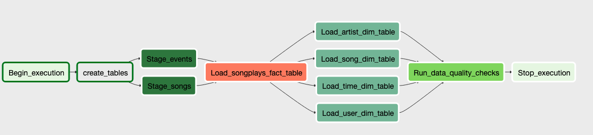

# Million Song Dataset JSON -> AWS RedShift

Load data from the [Million Song Dataset](https://labrosa.ee.columbia.edu/millionsong/) into a final dimensional model in RedShift utilizing Apache Airflow. 

## Introduction

A fictional music streaming startup, Sparkify, has grown their user base and song database and want to move their processes and data onto the cloud. Their data resides in S3, in a directory of JSON logs on user activity on the app, as well as a directory with JSON metadata on the songs in their app. The files in this repository will assist in loading the data into a final dimensional model in AWS RedShift.

## Apache Airflow Operators

Data is extracted from S3 buckets and loaded into staging tables. Apache Airflow is utilized to coordinate data transfer and transformations. 4 operators are created:

* StageToRedshiftOperator
    * Stages data from both event and songs source JSON files
* LoadFactOperator
    * Loads data into songplays fact table
* LoadDimensionOperator
    * Loads data into all dimension tables
    * Optionally truncates dimension before loading
* DataQualityOperator
    * Generic operator to perform any SQL data quality check passed to it

## Apache Airflow DAG

An Apache Airflow DAG was created utilizing the above operators.

## Installation

Clone this repository:

`git clone https://github.com/rigganni/Million-Song-Apache-Airflow-AWS-RedShift`

Set up the following variables in dwh.cfg:

| variable | description |
| ------------ | --------- |
| DWH_CLUSTER_TYPE | multi-node |
| DWH_NUM_NODES | number of nodes for cluster |
| DWH_NODE_TYPE | i.e. dc2.large |
| DWH_HOST | will be written to in create_redshift_cluster_database.py |
| DWH_IAM_ROLE_NAME | i.e. dwhRoleS3 |
| DWH_CLUSTER_IDENTIFIER | dwhCluster |
| DWH_DB | dev |
| DWH_DB_USER | aws |
| DWH_DB_PASSWORD | Your password |
| DWH_PORT | specify port (i.e. 5439) |
| DWH_REGION | us-west-2 since required S3 files are stored there |
| DWH_CLUSTER_SUBNET_NAME | use if RedShift cluster is required in specific VPC |
| DWH_ROLE_ARN | written to in create_redshift_cluster_database.py |
| DWH_CLUSTER_SUBNET_GROUP_NAME | use if RedShift cluster is required in specific VPC |
| KEY | AWS key |
| SECRET | AWS secret |
| ARN | written to in create_redshift_cluster_database.py |
| LOG_DATA | s3://udacity-dend/log_data |
| LOG_JSONPATH | s3://udacity-dend/log_json_path.json |
| SONG_DATA | s3://udacity-dend/song_data |

## Usage

Ensure variables are set up in dwh.cfg as described in installation above.

Create RedShift IAM role, cluster, and database:

`python create_redshift_cluster_database.py`

Deploy files to proper directories in your Apache Airflow setup.
